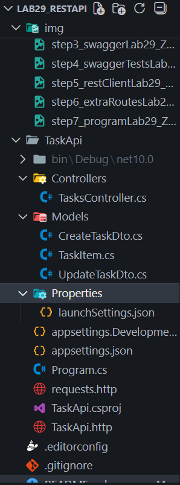

# Лабораторная работа №29: REST API на ASP.NET Core

## Основная информация
**ФИО:** Журавский Евгений Алексеевич
**Группа:** ИСП-231
**Дата:** 17.04.2026

## Краткое описание работы
Написал API для задач. Сделал все основные операции: получить список, добавить, изменить, удалить. Использовал контроллеры, DTO для входящих данных. Посмотрел, какие статусы возвращать в разных ситуациях. Поставил Swagger - через него удобно тестировать. Ещё добавил CORS, чтобы с другого порта можно было стучаться.

## Структура проекта

## Список всех реализованных маршрутов

| Метод | URL | Описание |
|-------|-----|----------|
| GET | /api/tasks | Получить все задачи |
| GET | /api/tasks/{id} | Получить задачу по id |
| GET | /api/tasks/search?query= | Поиск задач по заголовку или описанию |
| GET | /api/tasks/priority/{level} | Фильтр задач по приоритету (Low/Normal/High) |
| GET | /api/tasks/stats | Получить статистику по задачам |
| GET | /api/tasks/sorted?by=&desc= | Сортировка задач по priority/title/created |
| POST | /api/tasks | Создать новую задачу |
| PUT | /api/tasks/{id} | Полностью обновить задачу |
| PATCH | /api/tasks/{id}/complete | Переключить статус выполнения |
| DELETE | /api/tasks/{id} | Удалить задачу |

## Итоговая таблица ASP.NET Core Controller-based API

| Аспект | ASP.NET Core Controllers |
|--------|--------------------------|
| Маршруты | [HttpGet] атрибут над методом |
| Группировка маршрутов | Класс-контроллер |
| Базовый URL | [Route("api/[controller]")] |
| Параметр пути | (int id) — параметр метода |
| Параметр запроса | [FromQuery] bool? completed |
| Тело запроса | [FromBody] CreateTaskDto dto |
| Ответ 200 | return Ok(data) |
| Ответ 201 | return CreatedAtAction(...) |
| Ответ 404 | return NotFound(...) |
| Ответ 204 | return NoContent() |
| Типизация данных | Строгая (C#) |
| Документация | Swagger — устанавливается отдельно |

## Главные выводы

1. **REST** — не протокол, а архитектурный стиль. Те же принципы работают с любым языком и фреймворком. 

2. Контроллер в ASP.NET Core = Router в Express, только с автоматической документацией и строгой типизацией. 

3. DTO защищает API от некорректных данных: клиент передаёт только то, что сервер разрешает принять. 

4. Swagger UI позволяет тестировать API без Postman и без написания тестового JavaScript-кода. 

5. Правильные HTTP-статусы — часть «контракта» API. Клиент должен понимать, что произошло, по коду ответа.